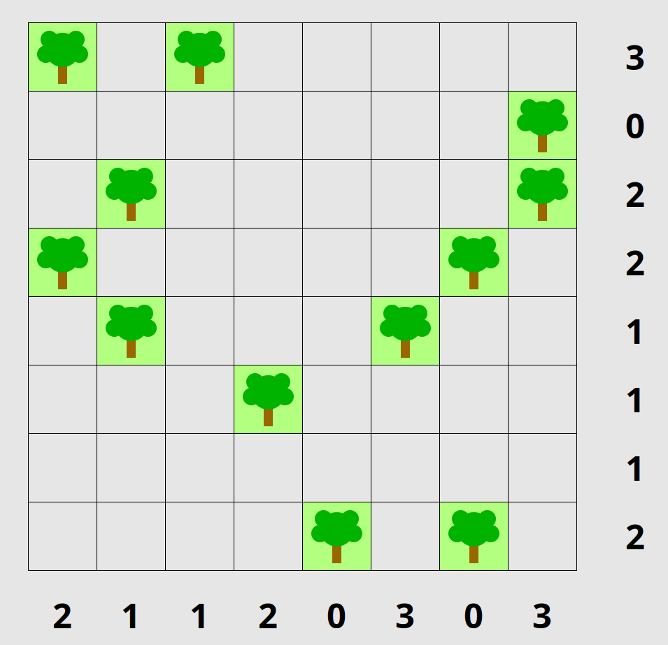
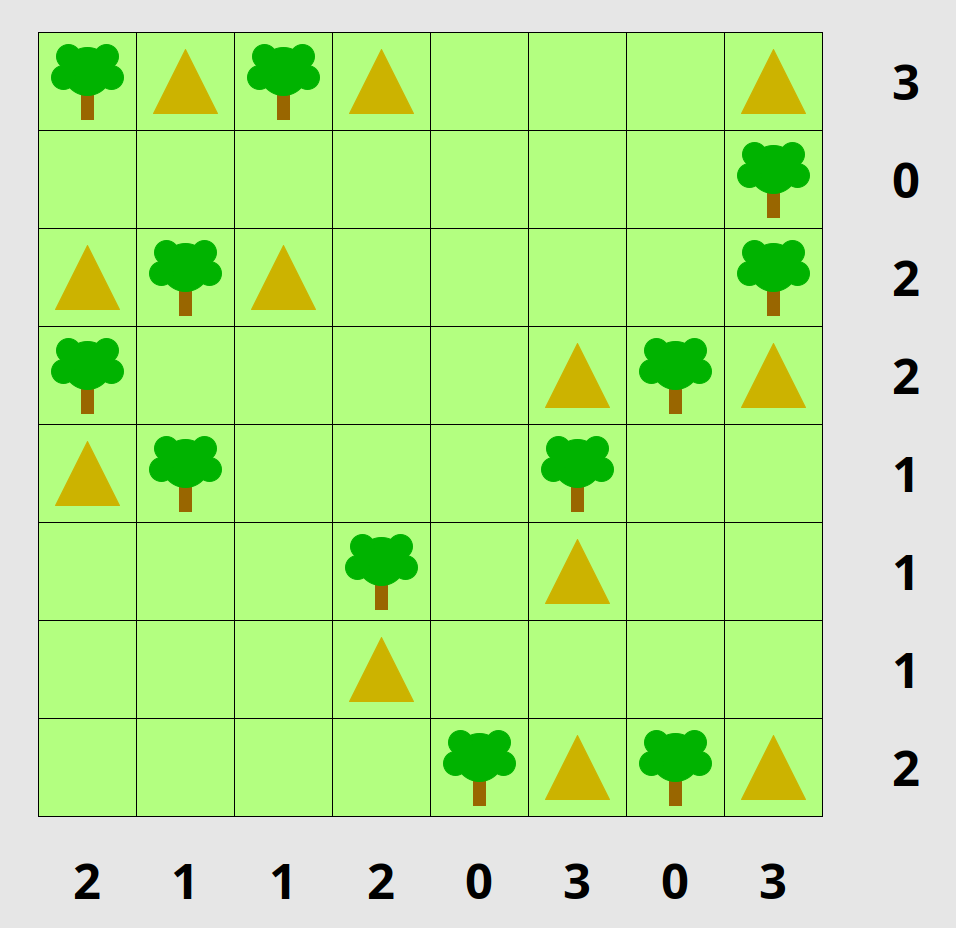
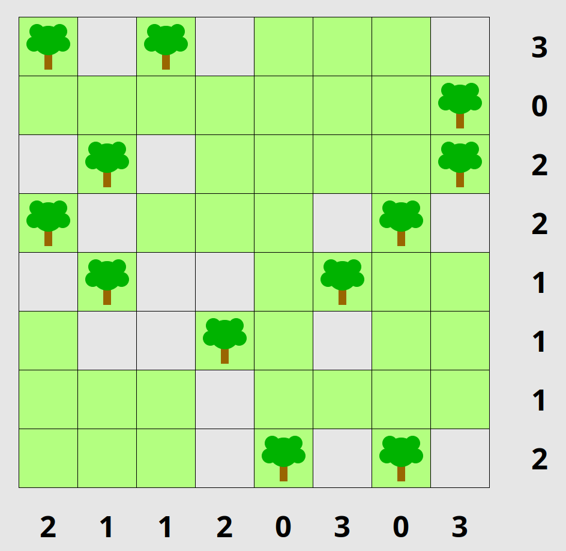

# Tents and Trees

## Bot in Action

## The Game

Tents and Trees is a classic logic game.
Each tree has one tent attached to it, and each tent is connected
to a tree either horizontally or vertically.
No tents are adjacent to each other, either horizontally,
vertically, or diagonally. At the start of the puzzle, you are
shown all the trees and must then deduce where each tent is.
To help you, the number of tents in each row and column is
displayed.

Sample puzzle:

Solution:

## Click Bot

My bot, written in Python, solves the puzzle partially.
At the beginning, it's a good idea to first mark cells
that contain grass. That is, what cells cannot have a
tent for sure?

Partial solution:

When you played this game a lot, then this initial step
(marking grass cells) can be a bit boring. My bot tries to
help in this initial phase.

The bot doesn't solve the puzzle, since this is the fun
part of the game and I didn't want to ruin that.

### v1

`v1.py` is a simpler version. It doesn't take the digits
into account. Once the bot finished its job, you'll have
to mark rows and columns manually with grass where the digit is 0.

### v2

`v2.py` is an improved version. It recognizes digits and if the
value is 0, then the whole row/column is filled with grass cells.

It calls the program `ocrad` that I found among the official
packages (`sudo pacman -S ocrad`).

## Usage

Install the package `puzzles` (under Manjaro Linux) and start
the game `puzzles-tents`. Maximize the window.

(Under **Ubuntu**, the name of the package is `sgt-puzzles`.
The game can be launched with `sgt-tents`).

Start the bot (`uv run v1.py` or `uv run v2.py`), switch
to the game and wait a few seconds. Then the bot starts
marking grass fields.
